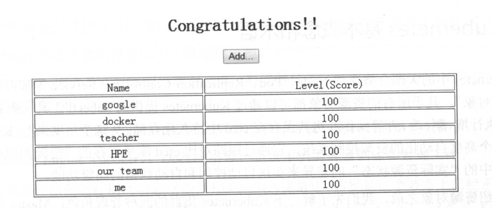

# 1.3.4 通过浏览器访问网页

经过上面的几个步骤，我们终于成功实现了 Kubernetes 上的第 1 个例子的部署搭建工作。现在一起来见证成果吧！

在你的电脑上打开浏览器，输入 `http://虚拟机:30001/demo`（比如：http://10.6.100.56:30001/demo ），看到如下图所示的网页界面，那么恭喜你，之前的努力没有白费，顺利闯关成功！。

至此，我们终于完成了 Kubenetes 上的 Tomcat 例子。但是，你一定很好奇两个应用之间是如何进行通信的，两个应用的配置文件中并没有关联？答案是，作者在 tomcat Pod 中通过名为 `mysql` 的域名与 mysql Pod 进行通信的。

这个例子并不是很复杂，我们也看到，相对于传统的分布式应用的部署方式，在 Kubenetes 之上我们仅仅通过一些容易理解的配置文件和相关和简单命令就完成了对整个集群的部署，这让我们惊诧于 Kubenetes 的创新和强大。

下一节，我们将对 Kubernetes 中的基本概念和术语进行全面学习，在这之前，讲者可以继续研究这个例子里的一些拓展内容，如下所述。

* 研究 RC、Service 等配置文件的格式。
* 熟悉 kubectl 的子命令。
* 手工停止某个 Service 对应的容器有什么现象发生。
* 修改 RC 文件，改变副本数量、重新发布，观察结果。

