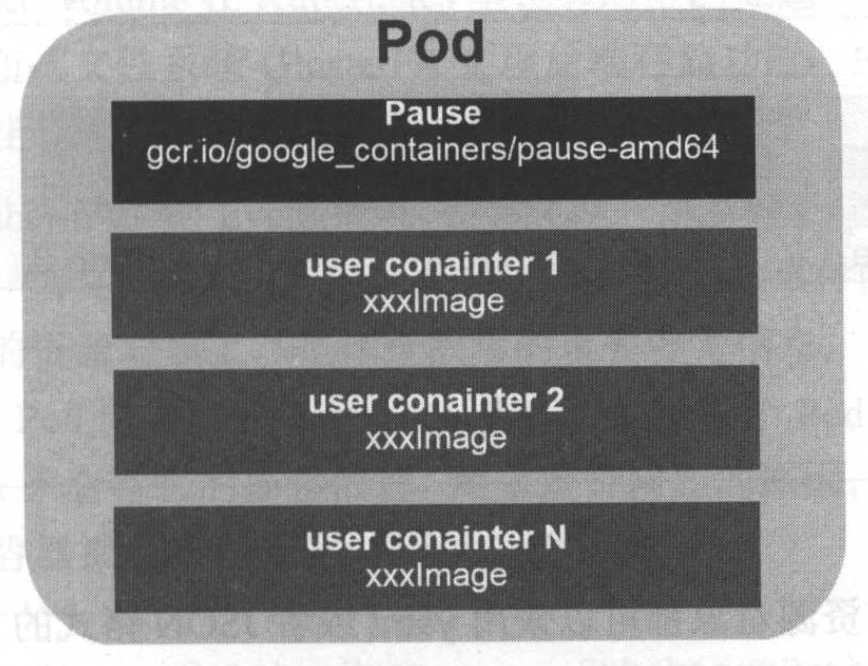
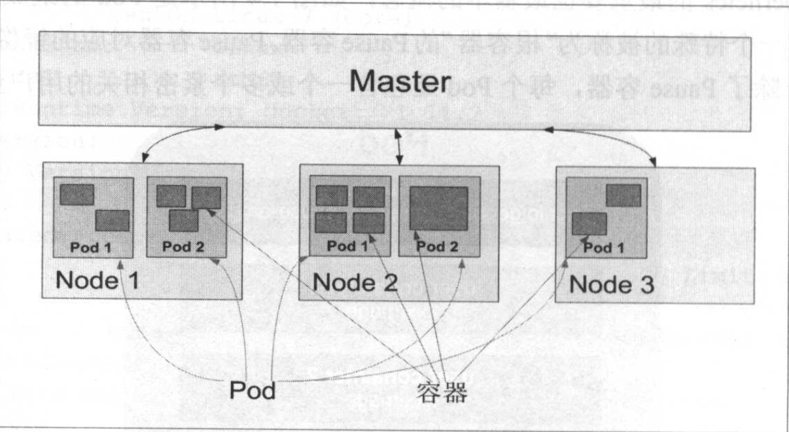
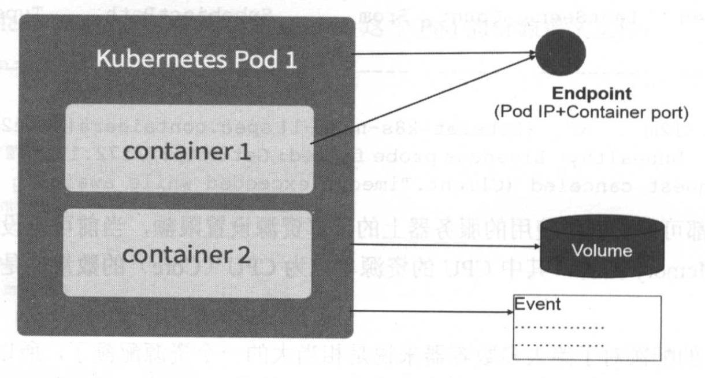

# 1.4.3 Pod

Pod 是 Kubernetes 最重要的基本概念，如下图所示是 Pod 的组成示意图，我们看到每个 Pod 都有一个特殊的被称为『根容器』的 Pause 容器。Pause 容器对应的镜像属于 Kubernetes 平台的一部分，除了 Pause 容器，每个 Pod 还包含一个或多个紧密相关的用户业务容器。



## 原因

为什么 Kubernetes 会设计出一个全新的 Pod 的概念并且 Pod 有这样特殊的组成结构？

原因之一：在一组容器作为一个单元的情况下，我们难以简单地对『整体』进行判断及有效地行动。比如，一个容器死亡了，此时算是整体死亡么？是 N/M 的死亡率么？引入业务无关并且不易死亡的 Pause 容器作为 Pod 的根容器，以它的状态代表整个容器组的状态，就简单、巧妙地解决了这个难题。

原因之二：Pod 里的多个业务容器共享 Pause 容器的 IP，共享 Pause 容器挂接的 Volume，这样既简化了密切关联的业务容器之间的通信问题，也很好地解决了它们之间的文件共享问题。

## 类型

Kubernetes 为每个 Pod 都分配了唯一的 IP 地址，称之为 Pod IP，一个 Pod 里的多个容器共享 Pod IP 地址。Kubernetes 要求底层网络支持集群内任意两个 Pod 之间的 TCP/IP 直接通信，这通常采用虚拟二层网络技术来实现，例如 Flannel、Open vSwitch 等，因此我们需要牢记一点：在 Kubernetes 里，一个 Pod 里的容器与另外主机上的 Pod 容器能够直接通信。

Pod 其实有两种类型：普通的 Pod 及静态 Pod（Static Pod），后者比较特殊，它并不存放在 Kubernetes 的 etcd 存储里，而是存放在某个具体的 Node 上的一个具体文件中，并且只在此 Node 上启动运行。而普通 Pod 一旦被创建，就会被放入到 etcd 中存储，随后会被 Kubernetes Master 调度到某个具体的 Node 上并进行绑定（Binding），随后该 Pod 被对应的 Node 上的 kubelet 进程实例化成一组相关的 Docker 容器并启动越来。在默认情况下，当 Pod 里的某个容器停止时，Kubernetes 会自动检测到这个问题并且重新启动这个 Pod（重启 Pod 里的所有容器），如果 Pod 所在的 Node 宕机，则会将这个 Node 上的所有 Pod 重新调度到其他节点上。

Pod、容器与 Node 的关系图如下图所示。



## 资源对象

Kubernetes 里的所有资源对象都可以采用 yaml 或者 json 格式的文件来定义或描述，下面是我们在之前的例子里用到的 myweb Pod 的资源定义文件：
```yaml
apiVersion: v1
kind: Pod
metadata:
  name: myweb
  labels:
    name: myweb
spec:
  containers:
  - name: myweb
    image: kubeguide/tomcat-app:v1
    ports:
    - containerPort: 8080
```

声明：
* Kind 为 Pod 表明这里这是一个 Pod 的定义。
* metadata 里的 name 属性为 Pod 的名字，metadata 里还能定义资源对象的标签（Label），这里声明 myweb 拥有一个 name=myweb 的标签。
* Pod 里所包含的容器组的定义则在 spec 一节中声明：
	* 名字为 myweb
	* 镜像为 kubeguide/tomcat-app:v1
	* 在 8080 端口（containerPort）上启动容器进程

Pod 的 IP 加上这里的容器端口（containerPort），就组成了一个新的概念 --- Endpoint，它代表着此 Pod 里的一个服务进程的对外通信地址。一个 Pod 也存在着具有多个 Endpoint 的情况，比如我们把 Tomcat 定义为一个 Pod 时，可以对外暴露管理端口与服务端口两个 Endpoint。

我们所熟悉的 Docker Volume 在 Kubernetes 里也有对应的概念 --- Pod Volume，后者有一些扩展，比如可以用分布式文件系统 GlusterFS 实现后端存储功能；Pod Volume 是定义在 Pod 之上，然后被各个容器挂载到自己的文件系统中的。

这里顺便提一下 Kubernetes 的 Event 概念，Event 是一个事件的记录，记录了事件的最早产生时间、最后重现时间、重复次数、发起者、类型，以及导致此事件的原因等众多信息。Event 通常会关联到某个具体的资源上，是排查故障的重要参考信息，之前我们看到 Node 的描述信息包括了 Event，而 Pod 同样有 Event 记录，当我们发现某个 Pod 迟迟无法创建时，可以用 `kubectl describe pod <POD_NAME>` 来查看它的描述信息，用来定位问题的原因，比如下面这个 Event 记录信息表明 Pod 里的一个容器被探针检测为失败一次：
```text
Events:
  FirstSeen    LastSeen    Count    From                    SubobjectPath                Type       Reason       Message
  ---------    --------    -----    ----                    -------------                ----       ------       -------
  10h          12m         32       {kubelet k8s-node-1}    spec.containers{kube2sky}    Warning    Unhealthy    Liveeness probe failed: Get http://172.17.1.2:8080/healthz: net/http: request canceled (Client.Timeout exceeded while awaiting headers)
  ```

每个 Pod 都可以对其能使用的服务器上的计算资源设置限额，当前可以设置限额的计算资源有 CPU 和 Memory 两种，其中 CPU 的资源单位为 CPU（Core）的数量，是一个绝对值而非相对值。

一个 CPU 的配额对于绝大多数容器来说是相当大的一个资源配额了，所以，在 Kubernetes 里，通常千分之一的 CPU 配额为最小单位，用 `m` 来表示。通常一个容器的 CPU 配额被定义为 100m ~ 300m，即占用 0.1 ~ 0.3 个 CPU。由于 CPU 配额是一个绝对值，所以无论在拥有一个多少个 Core 的机器上，100m 这个配额所代表的 CPU 的使用量都是一样的。与 CPU 配额类似，Memory 配额也是一个绝对值，它的单位是内存字节数。

在 Kubernetes 里，一个计算资源进行配额限定需要设定以下两个参数：
* Requests：是资源的最小申请量，系统必须满足要求。
* Limits：该资源最大允许使用的量，不能被突破，当容器试图使用超过这个量的资源时，可能会被 Kubernetes Kill 并重启。

通常我们会把 Requests 设置为一个比较小的数值，符合容器平时的工作负载情况下的资源需求，而把 Limit 设置为峰值负载情况下资源占用的最大量。比如下面这段定义，表明 MySQL 容器申请最少 0.25 个 CPU 及 64 MiB 内存，在运行过程中 MySQL 容器所能使用的资源配额为 0.5 个 CPU 及 128 MiB 内存：
```yaml
spec:
  containers:
  - name: db
    image: mysql
    resources:
      requests:
        cpu: "250m"
        memory: "64Mi"
      limits:
        cpu: "500m"
        memory: "128Mi"
```

## 总结

本节最后，笔者给出 Pod 及 Pod 周边对象的示意图作为总结，如下图所示，后面部分还会涉及这张图的对象和概念，以进一步加强理解。


