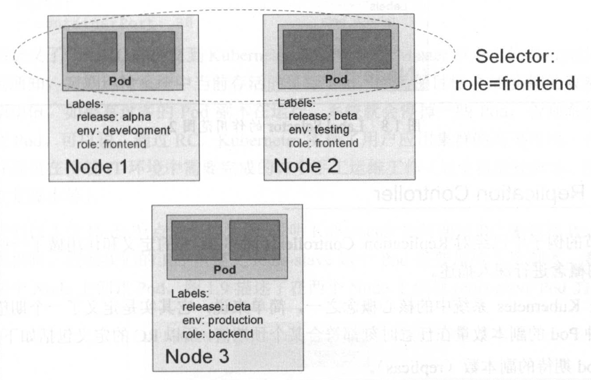
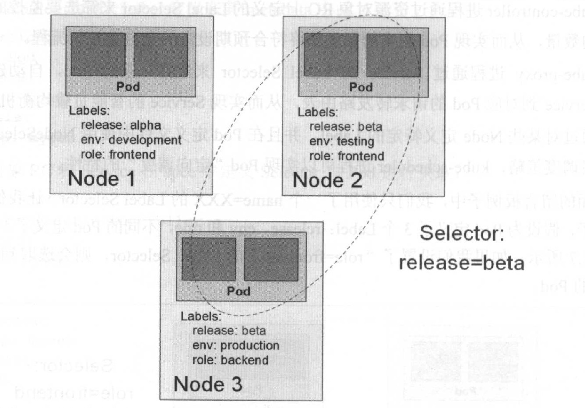

# 1.4.4 Label

Label（标签）是 Kubernetes 系统中另外一个核心概念。一个 Label 是一个 key=value 的键值对，其中 key 与 value 由用户自己指定。Label 可以被附加到各种资源对象上，例如 Node、Pod、Service、RC 等，一个资源对象可以定义任意的 Label，同一个 Label 也可以被添加到任意数量的资源对象上。Label 通常在资源对象定义时确定，也可以在对象创建后动态添加或者删除。

我们可以通过给指定的资源对象捆绑一个或多个不同的 Label 来实现多维度的资源分组管理功能，以便灵活、方便地进行资源分配、调度、配置、部署等管理工作。例如、部署不同版本的应用到不同的环境中：监控和分析应用（日志记录、监控、告警）等。一些常用的 Label 示例如下：
* 版本标签："release": "stable"         "release": "canary"
* 环境标签："environment": "dev"        "environment": "qa"         "environment": "production"
* 架构标签："tier": "frontend"          "tier": "backend"           "tier": "middleware"
* 分区标签："partition": "customerA"    "partition": "customerB"    
* 质量管控标签："track": "daily"         "track": "weekly"

## Label Selector

Label 相当于我们熟悉的『标签』。给某个资源对象定义一个 Label，就相当于给它打了一个标签，随后可以通过 Label Selector（标签选择器）查询和筛选拥有某些 Label 的资源对象，Kubernetes 通过这种方式实现了类似 SQL 的简单又能用的对象查询机制。

Label Selector 可以被类比为 SQL 语句中 where 查询条件，例如，name=redis-slave 这个 Label Selector 作用于 Pod 时，可以被类比为 `select * from pod where pod's name = 'redis-slave'` 这样的语句。当前有两种 Label Selector 表达式：
* 基于等式（Equality-based）
* 基于集合（Set-based）

基于等式表达式采用等式类表达式匹配标签，下面是一些具体的例子：
* name = redis-slave：匹配所有具有标签 name=redis-slave 的资源对象。
* env != production：匹配所有不具有标签 env=production 的资源对象，比如 env=test就是满足此条件的标签之一。

基于集合表达式使用集合操作类表达式匹配标签，下面是一些具体的例子：
* name in ( redis-slave, redis-master)：匹配所有具有 name=redis-slave 或 name=redis-master 的资源对象。
* name not in (php-frontend)：匹配所有不具有标签 name=php-frontend 的资源对象。

可以通过多个 Label Selector 表达式的组合实现复杂的条件选择，多个表达式之间用『,』进行分隔即可，几个条件之间是『AND』关系，即同时满足多个条件，例如：
```
name=redis-slave,env!=production
name not in (php-frontend),env!=production
```

以 myweb Pod 为例，Label 被定义在 metadata 中：
```yaml
apiVersion: v1
kind: Pod
metadata:
  name: myweb
  labels:
    app: myweb
```

管理对象 RC 和 Service 则通过 Selector 字段设置需要关联 Pod 的 Label：
```yaml
apiVersion: v1
kind: ReplicationController
metadata:
  name: myweb
spec:
  replicas: 1
  selector:
    app: myweb
......

----------

apiVersion: v1
kind: Service
metadata:
  name: myweb
spec:
  selector: 
    app: myweb
  ports:
  - port: 8080
```

其他管理对象如 Deployment、ReplicaSet、DaemonSet 和 Job 则可以在 Selector 中使用基于集合的筛选条件定义，例如：
```yaml
selector:
  matchLabels:
    app: myweb
  matchExpressions:
  - {key: tier, operator: In, values: [frontend]}
  - {key: environment, operator: NotIn, values: [dev]}
```

matchLabels 用于定义一组 Label，与直接写在 Selector 中的作用相同；matchExpressions 用于定义一组基于集合的筛选条件，可用的条件运算符包括 In、NotIN、Exists和NotExists。

如果同时设置了 matchLabels 和 matchExpressions，则两组条件为 AND 关系，则需要同时满足所有条件才能完成 Selector 的筛选。

Label Selector 在 Kubernetes 中的重要使用场景如下：
* kube-controller 进程通过在资源对象 RC 上定义的 Label Selector 来筛选要监控 Pod 副本数量，使 Pod 副本数量始终符合预期设定的全自动控制流程。
* kube-proxy 进程通过 Service 的 Label Selector 来选择对应的 Pod，自动建立每个 Service 到对应的 Pod 请求转发路由表，从而实现 Service 的智能负载均衡机制。
* 通过对某些 Node 定义特定的 Label，并且在 Pod 定义文件中使用 NodeSelector 这种标签调度策略，kube-scheduler 进程可以实现 Pod 定向调度的特性。

在前面的例子中，我们只使用了一个 name=<NAME> 的 Label Selector。看一下更复杂的例子：假设为 Pod 定义了 3 个 Label Selector：release、env和role，不同的 Pod 定义了不同的 Label 值，如下图所示：
* 如果设置了『role=frontend』的 Label Selector，则会选取到 Node1 和 Node2 上的 Pod。
* 如果设置了『release=beta』的 Label Selector，则会选取到 Node2 和 Node3 上的 Pod。





## 总结

总之，使用 Label 可以给对象创建多组标签，Label 和 Label Selector 共同构成了 Kubernetes 系统中核心的应用模型，使得被管理对象能够被精细地分组管理，同时实现了整个集群的高可用性。
