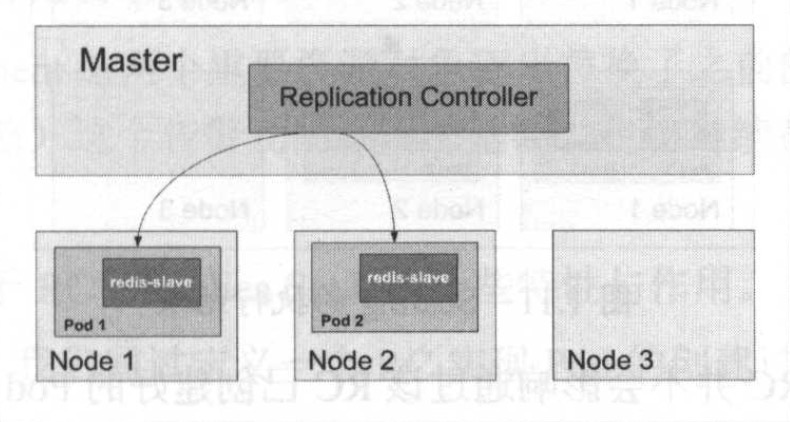
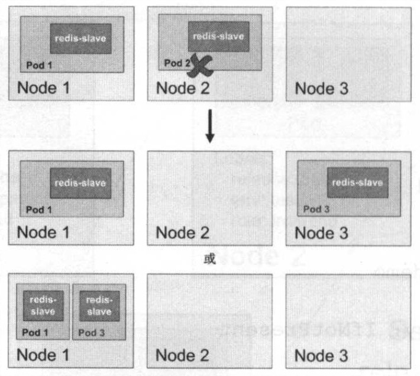
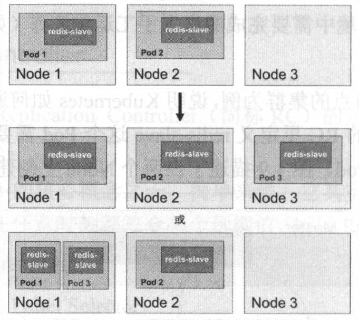

# 1.4.5 Replication Controller

在上一节的例子中已经对 Replication Controller（简称 RC）的定义和作用做了一些说明，本节对 RC 的概念进行深入描述。

RC 是 Kubernetes 系统中的核心概念之一，简单来说，它其实定义了一个期望的场景，即声明某种 Pod 的副本数量在任意时刻都符合某个预期值，所以 RC 的声明包含以下几个部分：
* Pod 期待的副本数量
* 用于筛选目标 Pod 的 Label Selector
* 当 Pod 副本数量小于预期数量时，用于创建新的 Pod 的 Pod 模板（template）

下面是一个完事的 RC 定义的例子，即确保拥有 tier=frontend 标签的这个 Pod（运行 tomcat 容器）在整个 Kubernetes 集群中始终只有一个副本：
```yaml
apiVerison: v1
kind: ReplicationController
metadata:
  name: frontend
spec:
  replicas: 1
  selector:
    tier: frontend
  template:
    metadata:
      labels:
        app: app-demo
        tier: frontend
    spec:
      containers:
      - name: tomcat-demo
        image: tomcat
        imagePullPolicy: IfNotPresent
        env:
        - name: GET_HOSTS_FROM
          values: dns
        ports:
        - containerPort: 80
```

在我们定义了一个 RC 并将其提交到 Kubernetes 集群中后，Master 上的 Controller Manager 组件就得到通知，定期巡检系统中当前戚的目标 Pod，并确保目标 Pod 实例的数量刚好等于 RC 的期望值，如果有过多的 Pod 副本在运行，系统将会停掉一些 Pod，否则系统会再自动创建一些 Pod。可以说，通过 RC，Kubernetes 实现了用户应用集群的高可用性，并且大减少了系统管理员在传统 IT 环境中需要完成的许多手工运维工作（如主机监控脚本、应用监控脚本、故障恢复脚本等）。

## 示例

下面以有 3 个 Node 的集群为例，说明 Kubernetes 如何通过 RC 来实现 Pod 副本数量自动控制的机制。假如在我们的 RC 里定义 redis-slave 这个 Pod 需要保持两个副本，系统将可能在其中的两个 Node 上创建 Pod，如下图所示。



假设 Node 2 上的 Pod 2 意外终止，则根据 RC 定义的 replicas 数量 2，Kubernetes 将会自动创建并启动一个新的 Pod，以保证在整个集群中始终有两个 redis-slave Pod 运行。

如下图所示，系统可能选择 Node 3 或者 Node 1来创建一个新的 Pod。



## Scaling

此外，在运行时，我们可以通过修改 RC 副本数量来实现 Pod 动态伸缩（Scaling），这可以通过执行 `kubectl scale` 命令来一键完成：
```bash
kubectl scale rc redis-slave --replicas=3
```

Scaling 的执行结果如下图所示：



> 注意：删除 RC 并不会影响通过该 RC 已创建好的 Pod。为了删除所有的 Pod，可以设置 replicas 的值为 0，然后更新该 RC。另外 kubectl 提供了 stop 和 delete 命令来一次性删除 RC 和 RC 控制的全部 Pod。

应用升级时，通常会使用一个新的容器镜像版本替代旧版本。我们希望系统平滑升级，比如在当前系统中有 10 个对应的旧版本的 Pod，则最佳的系统升级方式的是旧版本的 Pod 每停止一个，就同时创建一个新版本的 Pod，在整个升级过程中此消彼长，而运行中的 Pod数量始终是 10 个，几分钟后，当所有的 Pod 都已经是新版本时，系统升级完成。通过 RC 机制，Kubernetes 很容易就实现了这种高级实用的特性，被称为『滚动升级』（Rolling Update），具体的操作方法详见 3.11 节的说明。

## Replica Set

Replication Controller 由于与 Kubernetes 代码中的模块 Replication Controller 同名，同时 『Replication Controller』无法准确表达它的配音，所在 Kubernetes 1.2 中，升级为另外一个概念 --- Replica Set，官方解释其为『下一代 RC』。Replica Set 与 RC 当前的唯一的区别是，Replica Sets 支持基于集合的 Label Selector，而 RC 只支持基于等式的 Label Selector，这使得 Replica Set 功能更强。下面是等价于之前 RC 例子的 Replica Set 的定义（省去 Pod 模板部分）：
```yaml
apiVersion: v1
kind: ReplicaSet
metadata:
  name: frontend
spec:
  selector:
    matchLabels:
      tier: frontend
    matchExpressions:
      - {key: tier, operator: In, values: [frontend]}
  template:
  ......
```

kubectl 命令行工具适用于 RC 的绝大部分命令同样适用于 ReplicaSet。此外，我们当前很少单独使用 Replica Set，它主要是被 Deployment 这个更高层的资源对象所使用，从而形成一整套 Pod 创建、删除、更新的编排机制。我们在使用 Deployment时，无须关心它是如何创建和维护 Replica Set的，这一切都是自动发生的。

Replica Set 与 Deployment 这两个重要的资源对象逐步替代了之前的 RC 的作用，是 Kubernetes 1.3 里 Pod 自动扩容（伸缩）这个告警功能实现的基础，也将继续在 Kubernetes 未来的版本中发挥重要的作用。

## 总结

最后总结一下 RC（Replica Set）的一些特性与作用：
* 在大多数情况下，我们通过定义一个 RC 实现 Pod 的创建及副本数量的自动控制。
* 在 RC 里包括完整的 Pod 定义模板。
* RC 通过 Label Selector 机制实现对 Pod 副本的自动控制。
* 通过改变 RC 里的 Pod 副本数量，可以实现 Pod 的扩容和缩容。
* 通过改变 RC 里的 Pod 模板中的镜像版本，可以实现 Pod 的滚动升级。
