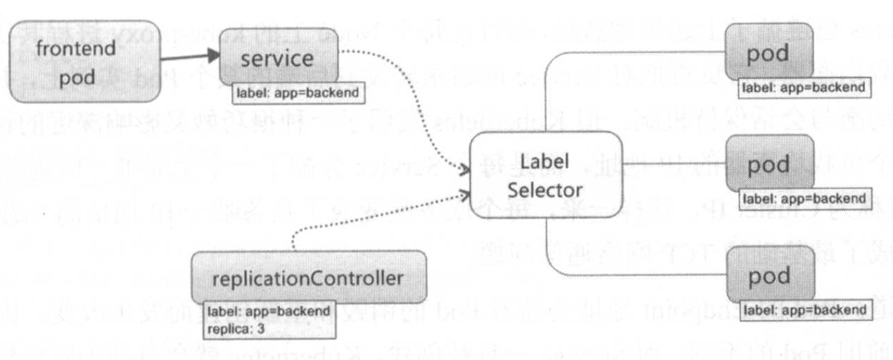
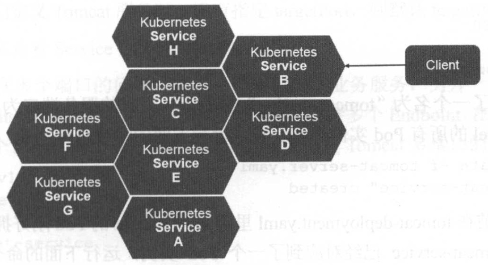

# 1. 概述

Service 服务也是 Kubernetes 里的核心资源对象之一，Kubernetes 里的每个 Service 其实就是我们经常提供的微服务架构中的一个微服务，之前讲解 Pod、RC 等资源对象其实都是在为讲解 Kubernetes Service 使用铺垫。下图显示了 Pod、RC 与 Service 的逻辑关系：



上图可以看到，Kubernetes 中的 Service 定义了一个服务的访问入口地址，前端的应用（Pod）通过这个入口地址访问其背后的一组由 Pod 副本组成的集群实例，Service 与其后端 Pod 副本集群之间通过 Label Selector 来实现无缝对接。RC 的作用实际上是保证 Service 的服务能力和服务质量始终符合预期标准。

通过分析，识别并建模系统中的所有服务为微服务 --- Kubernetes Service，我们的系统最终由多个提供不同业务能力而又彼此独立的微服务单元组成的，服务之间通过 TCP/IP 进行通信，从而形成了强大而又灵活的弹性网络，拥有强大的分布式能力、弹性扩展能力、容错能力，程序架构也变得简单和直观许多，如下图所示：



既然每个 Pod 都会被分配一个单独的 IP 地址，而且每个 Pod 都提供了一个独立的 Endpoint（Pod IP + ContainerPort）以被客户端访问，现在多个 Pod 副本组成了一个集群来提供服务，那么客户端如何来访问它们呢？一般的做法是部署一个负载均衡器（软件或硬件），为这组 Pod 开启一个对外的服务端口（如 8080），并且将这些 Pod 的 Endpoint 列表加入服务端口的转发列表，客户端就可以通过负载均衡器的对外 IP 地址 + 服务端口来访问此服务。客户端的请求最后会被转发到哪个 Pod，由负载均衡器的算法所决定。

Kubernetes 也遵循上述的常规做法，运行在每个 Node 上的 kube-proxy 进程其实就是一个智能的软件负载均衡器，负责把对 Service 的请求转发到后端的某个 Pod 实例上，并在内部实现服务的负载均衡与会话保持机制。但 Kubernetes 发明了一种很巧妙又影响深远的设计：Service 没有共用一个负载均衡器的 IP 地址，每个 Service 都被分配了一个全局唯一的虚拟 IP 地址，这个 虚拟 IP 被称为 ClusterIP。这样一来，每个服务就变成了具备唯一 IP 地址的通信节点，服务调用就变成了最基础的 TCP 网络通信问题。

我们知道，Pod 的 Endpoint 地址会随着 Pod 的销毁和重新创建而发生改变，因为新的 Pod 的 IP 地址与之前旧的 Pod 的不同。而 Service 一旦被创建，Kubernetes 就会自动为它分配一个可用的 ClusterIP，而且在 Service 的整个生命周期内，它的 ClusterIP 不会发生改变。于是，服务发现这个棘手的问题在 Kubernetes 的架构 里也得以轻松解决：只要用 Service 的 Name 与 Service 的 ClusterIP 地址做一个 DNS 域名映射 即可完美解决问题。现在想想，这真是一个很棒的设计。

## 示例

创建一个名为 tomcat-service.yaml 的定义文件：
```yaml
apiVersion: v1
kind: Service
metadata:
  name: tomcat-service
spec:
  ports:
  - port: 8080
  selector:
    tier: frontend
```

上述内容定义了一个名为 tomcat-service 的 Service，它的服务端口为 8080，拥有 "tier=frontend" Label 的所有 Pod 实例都属于它，运行下面的命令进行创建：
```bash
kubectl create -f tomcat-service.yaml
```

我们之前在 tomcat-deployment.yaml 里定义的 Tomcat 的 Pod 刚好拥有这个标签，所以刚才创建的 tomcat-service 已经对应一个 Pod 实例，运行下面的命令可以查看 tomcat-service 的 Endpoint 列表
* `10.244.2.13` 是 Pod IP 地址
* `8080` 是 Container 暴露的端口

```bash
kubectl get endpoints
```
```text
NAME             ENDPOINTS                         AGE
kubernetes       10.6.100.56:6443                  14d
tomcat-service   10.244.2.13:8080                  20s
```

但是，说好的 Service 的 ClusterIP呢？运行下面的命令，可以看到 Service 被分配的 ClusterIP 及更多的信息：
```bash
kubectl get svc tomcat-service -o yaml
```
```text
apiVersion: v1
kind: Service
metadata:
  creationTimestamp: "2020-05-07T04:01:35Z"
  managedFields:
  - apiVersion: v1
    fieldsType: FieldsV1
    fieldsV1:
      f:spec:
        f:ports:
          .: {}
          k:{"port":8080,"protocol":"TCP"}:
            .: {}
            f:port: {}
            f:protocol: {}
            f:targetPort: {}
        f:selector:
          .: {}
          f:tier: {}
        f:sessionAffinity: {}
        f:type: {}
    manager: kubectl
    operation: Update
    time: "2020-05-07T04:01:35Z"
  name: tomcat-service
  namespace: default
  resourceVersion: "1839657"
  selfLink: /api/v1/namespaces/default/services/tomcat-service
  uid: 276eb5f8-4335-477e-bb0e-18e97e182935
spec:
  clusterIP: 10.98.133.184
  ports:
  - port: 8080
    protocol: TCP
    targetPort: 8080
  selector:
    tier: frontend
  sessionAffinity: None
  type: ClusterIP
status:
  loadBalancer: {}
```

解释如下：
* targetPort 属性用来确定提供该服务的容器所暴露（EXPOSE）的端口号，即具体业务进程在容器内的 targetPort 上提供的 TCP/IP 接入；
* port 属性则定义了 Service 的虚端口。
* 前面定义 Tomcat 服务时没有指定 targetPort，则默认 targetPort 与 Port 相同。

## 多端口

接下来看看 Service 多端口问题

很多服务都存在多个端口的问题，通常一个端口提供业务服务，另外一个端口提供管理服务，比如 mycat、codis 等常见中间件。Kubernetes Service 支持多个 Endpoint，在存在多个 Endpoint 的情况下，要求每个 Endpoint 都定义一个名称来区分。下面是 Tomcat 多端口 Service 定义样例：
```
apiVersion: v1
kind: Service
metadata:
  name: tomcat-service
spec:
  ports:
  - port: 8080
    name: service-port
  - port: 8005
    name: shutdown-port
  selector:
    tier: frontend
```

多端口为什么需要给每个端口都命令呢？这就涉及 Kubernetes 的服务发现机制了，接下来进行讲解。

