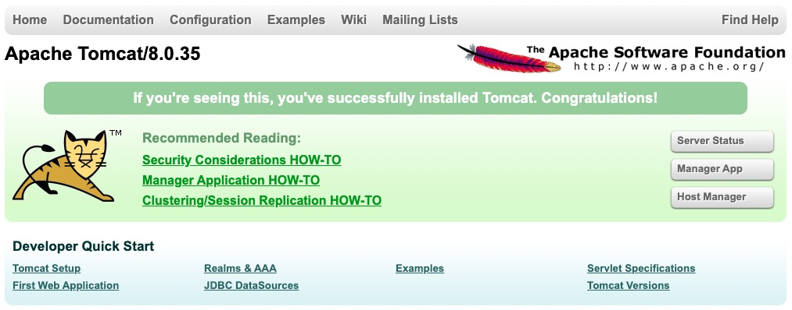
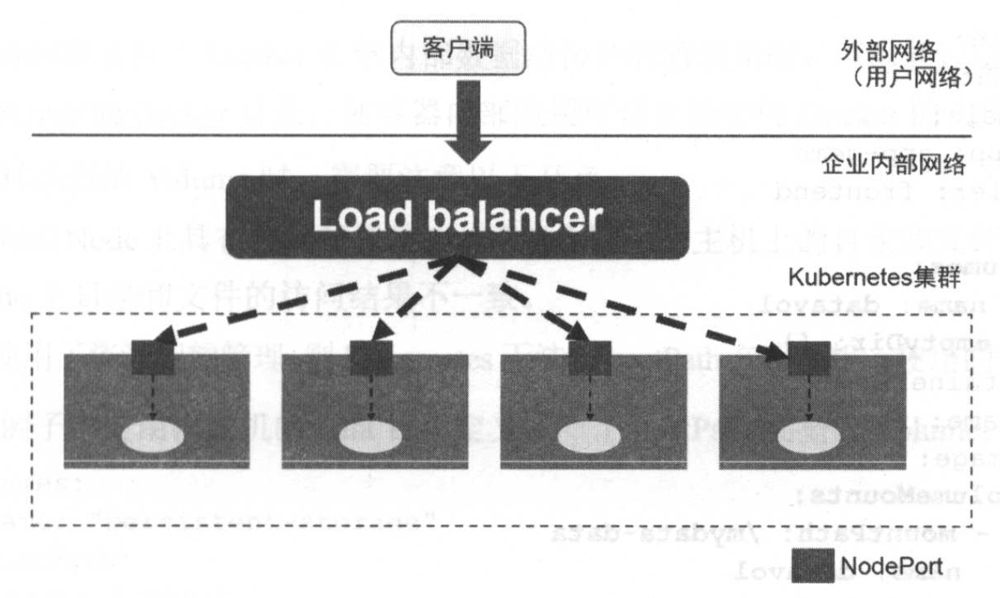

# 3. 外部系统访问 Service 的问题

## IP

为了更深入地理解和掌握 Kubernetes，我们需要弄明白 Kubernetes 里的 3 种 IP：
* Node IP：Node 的 IP 地址
* Pod IP：Pod 的 IP 地址
* Cluster IP：Service 的 IP 地址

首先，Node IP 是 Kubernetes 集群中每个节点的物理网卡的 IP 地址，是一个真实存在的物理网络，所有属于这个网络的服务器都能通过这个网络直接通信，不管其中是否有部分节点不属于这个 Kubernetes 集群。这也表明在 Kubernetes 集群之外的节点访问 Kubernetes 集群之内的某个节点或者 TCP/IP 服务时，都必须通过 Node IP 通信。

其次，Pod IP 是每个 Pod 的 IP 地址，它是 Docker Engine 根据 docker0 网桥的 IP 地址段进行分配的，通常是一个虚拟的二层网络，前面说过，Kubernetes 要求位于不同 Node 上的 Pod 都能够直接彼此通信，所以 Kubernetes 里一个 Pod 里的容器访问另一个 Pod 里的容器时，就是通过 Pod IP所在的虚拟二层网络进行通信的，而真实的 TCP/IP 流量是通过 Node IP所在的物理网卡流出的。

最后，说说 Service 的 Cluster IP，它也是一种虚拟的 IP，但更像一个『伪造』的 IP 网络，原因如下：
* ClusterIP 仅仅作用于 Kubernetes Service 这个对象，并由 Kubernetes 管理和分配 IP 地址（来源于 ClusterIP 地址池）。
* ClusterIP 无法被 ping，因为没有一个『实体网络对象』来响应。
* ClusterIP 只能结合 Service Port 组成一个具体的通信端口，单独的 ClusterIP 不具备 TCP/IP 通信的基础，并且它们属于 Kubernetes 集群这样一个封闭的空间，集群外的节点如果要访问这个通信端口，则需要做一些额外的工作。
* 在 Kubernetes 集群内，Node IP 网、Pod IP 网和 Cluster IP 网之间的通信，采用的是 Kubernetes 自己设计的一种编程方式的特殊路由规则，与我们熟知的 IP 路由有很大的不同。

## NodePort

根据上面的分析和总结，我们基本明白了：Service 和 Cluster IP 属于 Kubernetes 集群内部的地址，无法在集群外部直接使用这个地址。那么矛盾来了：实际上在我们开发的业务系统中肯定有一部分服务要提供给 Kubernetes 集群外部的应用或用户来使用，典型的例子就是 Web 端口的服务模块，比如上面的 tomcat-service，那么用户怎么访问它？

采用 NodePort 是解决上述问题的最直接、有效的常见做法。以 tomcat-service 为例，在 Service 的定义里如下扩展即可：
```yaml
apiVersion: v1
kind: Service
metadata:
  name: tomcat-service
spec:
  type: NodePort
  ports:
  - port: 8080
    nodePort: 31002
  selector:
    tier: frontend
```

其中，nodePort:31002 这个属性表明手动指定 tomcat-service 的 NodePort 为 31002，否则 Kubernetes 会自动分配一个可用的端口。接下来在浏览器里访问 http://<NODE_IP>:31002，就可以看到 tomcat 的欢迎界面。



NodePort 的实现方式是在 Kubernetes 集群里的每个 Node 上都为需要外部访问的 Service 开启一个对应的 TCP 监听端口，外部系统只要用任意一个 NodeIP + NodePort 即可访问此服务，在任意 Node 上运行 netstat 命令，就可以看到有 NodePort 被监听：
```bash
netstat -ntpl | grep 31002
```
```text
tcp        0      0 0.0.0.0:31002           0.0.0.0:*               LISTEN      178045/kube-proxy
```

## Load balancer

但 NodePort 还没有完全解决外部访问 Service 的所有问题，比如负载均衡问题。假如在我们的集群中有 10 个 Node，则此时最好有一个负载均衡器，外部的请求只需要访问此负载均衡器的 IP 地址，由负载均衡器负载转发流量到后面某个 Node 的 NodePort 上，如下图：



上图 Load balancer 组件独立于 Kubernetes 集群之外，通常是由一个硬件的负载均衡器，或者是以软件方式实现的，例如 HAProxy 或 Nginx。对于每个 Service，我们通常需要配置一个对应的 Load balancer 实例来转发流量到后端的 Node 上，这的确增加了工作量及出错的概率。于是 Kubernetes 提供了自动化的解决方案，如果我们的集群运行在谷歌的公有云 GCE 上，那么只要把 Service 的 type=NodePort 改为 type=LoadBalancer，Kubernetes 就会自动创建一个对应的 Load balancer 实例并返回它的 IP 地址提供外部客户端使用。其他公有云只要实现了支持此特性的驱动，则也可以达到上述目的。此外裸机上的类似机制（Bare Metra Service Load Balancers）也在被开发。

