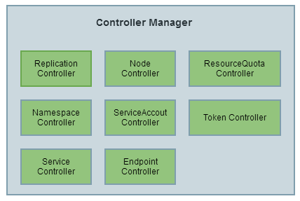

# Controller Manager 原理解析

一般来说，智能系统和自动系统通常会通过一个 “操作系统” 来不断修正系统的工作状态。在 Kubernetes 集群中，每个 Controller 都是这样的一个 “操作系统”，它们通过 API Server 提供的（List-Watch）接口实时监控集群中特定资源的状态变化，当发生各种故障导致某资源对象的状态发生变化时，Controller 会尝试将其状态调整为期望的状态。比如，当某个 Node 意外宕机时，Node Controller 会及时发现此故障并执行自动化修复流程，确保集群始终处于预期的工作状态。Controller Manager 是 Kubernetes 中各种操作系统的管理者，是集群内部的管理控制中心，也是 Kubernetes 自动化功能的核心。

